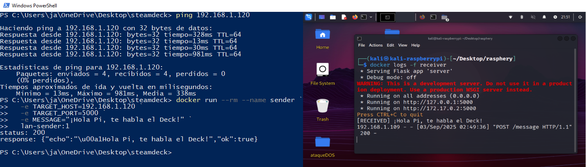
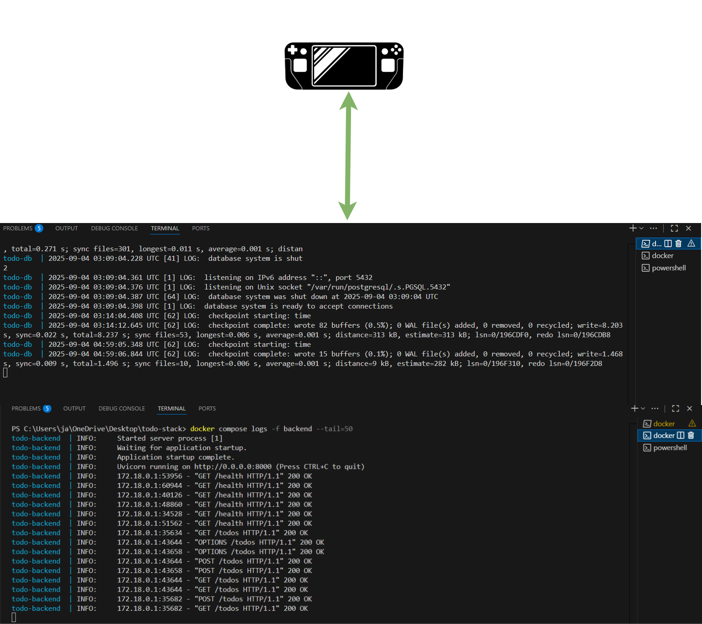
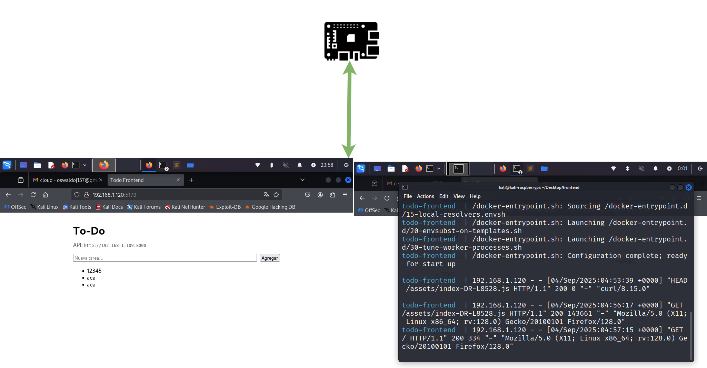

# Contenedores

El proyecto implementa una aplicación web tipo To-Do (CRUD) distribuida en tres servicios siguiendo el patrón de microservicios: frontend, backend (API) y base de datos.
- **Se despliega en dos máquinas de la red local (LAN):**
  - Máquina A – Steam Deck (Windows + Docker): aloja backend y base de datos en contenedores separados.
  - Máquina B – Raspberry Pi 4 (Docker ARM64): aloja el frontend estático servido por Nginx.

Objetivo didáctico: practicar orquestación con contenedores, separación de responsabilidades, comunicación entre servicios por red y uso de variables de entorno (12-factor).


- **Componentes y responsabilidades**
  - Frontend (Raspberry Pi 4, Docker) SPA construida (p. ej., React + Vite) y servida por Nginx.  
    Responsabilidad: interfaz de usuario y consumo de la API vía HTTP/JSON.  
  - Backend / API (Steam Deck, Docker) Servicio FastAPI (o Node/Express) que implementa la lógica de negocio y expone endpoints REST para crear, listar, actualizar y eliminar tareas.  
    Responsabilidad: validación, reglas de negocio, acceso a la BD.  
  - Base de datos (Steam Deck, Docker) Contenedor con PostgreSQL (o MySQL/MariaDB) que almacena las tareas en tablas relacionales.  
    Responsabilidad: persistencia y consultas de datos.  
- **Topología de red**
  - El frontend (Pi) se comunica con el backend (Deck) mediante la IP LAN de la Máquina A y el puerto 8000.
  - El backend se comunica con la base de datos por la red interna de Docker en la Máquina A (la BD no publica puertos al host).
  - No existe comunicación directa entre frontend y base de datos (principio de “backend-for-frontend”).


## 1.- Instalacion de docker
- **Raspberry Pi 4 Kali linux**
```bash
# Instala el engine desde Kali:
sudo apt update
sudo apt install -y docker.io
sudo systemctl enable --now docker
sudo usermod -aG docker $USER
newgrp docker

# Instala Compose v2 (ARM64):
mkdir -p ~/.docker/cli-plugins
curl -SL https://github.com/docker/compose/releases/download/v2.28.1/docker-compose-linux-armv7 \
  -o ~/.docker/cli-plugins/docker-compose
chmod +x ~/.docker/cli-plugins/docker-compose

# Probar:
docker --version
docker compose version

``` 
- **steam deck windows**

```bash
# en PowerShell:
wsl --install
wsl --set-default-version 2
wsl -l -v          # verifica que tu “Ubuntu” esté en versión 2

winget install -e --id Docker.DockerDesktop

wsl -l -v                 # lista tus distros
wsl --shutdown            # apaga todas

# dentro de Ubuntu (WSL)
which docker
docker --version
docker compose version
docker run --rm hello-world

``` 
## 2.- Conexión (Deck ↔ Pi por LAN)
- **2.1. Obtener la IP de la Raspberry Pi (Kali)**

```bash
# IPs asignadas (rápido)
hostname -I

# Wi-Fi (wlan0) o Ethernet (eth0), según uses:
ip -4 addr show wlan0 | sed -n 's/ *inet \([0-9.]*\).*/\1/p'
ip -4 addr show eth0  | sed -n 's/ *inet \([0-9.]*\).*/\1/p'

# Ver ruta por defecto (muestra la IP de origen “src …”)
ip route | head -n1
``` 
- **2.2. Levantar el receptor en la Raspberry Pi**

```bash
# construir imagen
docker build -t lan-receiver:1 .

# recrear contenedor y publicar el puerto a la LAN
docker rm -f receiver 2>/dev/null || true
docker run -d --name receiver -p 5000:5000 --restart unless-stopped lan-receiver:1

# comprobar
docker ps --filter name=receiver         # debe mostrar 0.0.0.0:5000->5000
ss -tulpn | grep ':5000'                 # debe estar en LISTEN
curl http://localhost:5000/health        # {"status":"ok"}
docker logs -f receiver                  # verás los mensajes recibidos

``` 
- **2.3. Levantar el emisor en el Steam Deck (Windows)**

```bash
ping <192.168.1.120>
Test-NetConnection <192.168.1.120> -Port 5000
curl.exe http://<192.168.1.120>:5000/health
``` 
Construir y enviar mensaje (PowerShell):

```bash
# construir imagen (una vez)
docker build -t lan-sender:1 .

# ejecutar (NO hace falta reconstruir para cambiar IP o texto)
docker run --rm --name sender `
  -e TARGET_HOST=<IP_PI> `
  -e TARGET_PORT=5000 `
  -e MESSAGE="¡Hola Pi, te habla el Deck!" `
  lan-sender:1
``` 
En la Pi, con docker logs -f receiver, verás:



## 3.- Arquitectura y responsabilidades

- **Frontend – Raspberry Pi (Nginx + React/Vite)**
  - Interfaz de usuario. Consume la API vía HTTP/JSON.
  - Expone **5173/tcp** hacia la LAN.
  - En el build se inyecta `VITE_API_URL="http://<IP_DECK>:8000"`.

- **Backend – Steam Deck (FastAPI + Uvicorn)**
  - Lógica de negocio y endpoints REST (`/health`, `/todos`).
  - Expone **8000/tcp** hacia la LAN.
  - CORS permite el origen del frontend: `CORS_ORIGINS=http://<IP_PI>:5173`.

- **Base de datos – Steam Deck (PostgreSQL 16 Alpine)**
  - Persistencia de tareas.
  - **Solo** accesible desde el backend por la **red interna de Docker** (hostname `db:5432`).
  - Volumen `pg_data` para persistencia.

**Flujo de red**
- Frontend (Pi) → Backend (Deck) por **LAN**: `http://<IP_DECK>:8000`.
- Backend (Deck) → DB (Deck) por **red interna de Docker**: `db:5432`.
- No hay acceso directo Frontend → DB.


## 4.- Correr contenedores
- **Deck (backend + DB):**
```bash
docker compose up -d --build
CORS_ORIGINS=http://<192.168.1.120>:5173
curl.exe http://localhost:8000/health   # {"status":"ok"}
``` 


- **Pi (frontend):**

```bash
docker compose build --no-cache
docker compose up -d
``` 


- **Tests**

```bash

curl http://<IP_DECK>:8000/health

curl.exe http://<IP_PI>:5173

``` 

## Problemas encontrados (Raspberry Pi + contenedores) y lecciones

Durante el desarrollo salieron varios tropiezos típicos al trabajar con Docker en una Raspberry Pi 4. Los documento aquí con **síntomas, causa y solución/mitigación**.

### 1) Builds lentos en la Pi (~6 minutos la primera vez)
- **Síntoma:** construir la imagen del frontend (Node + Vite) tardó ~6 min.
- **Causas probables:**
  - CPU/IO limitados de la Pi y SD card lenta.
  - Capas base pesadas (`node:20` ~200 MB). La primera vez hay que descargar todo.
  - Falta de caché: `npm ci` descarga el árbol completo.
- **Cómo mitigarlo:**
  - Usar imágenes más pequeñas: `node:20-alpine` para build y `nginx:stable-alpine` (ya se usa).
  - Habilitar caché de npm con BuildKit:
    ```dockerfile
    # dentro de la etapa build
    RUN --mount=type=cache,target=/root/.npm npm ci --prefer-offline --no-audit --progress=false
    ```
  - Añadir `.dockerignore` (reduce contexto y tiempo de envío):
    ```
    node_modules
    dist
    .git
    .DS_Store
    ```
  - Pre-construir multi-arquitectura en la máquina potente (Deck) y **push** a un registry (Docker Hub) con `buildx`, luego `docker pull` en la Pi.
  - Usar storage más rápido que la microSD (SSD por USB 3.0) si es posible.

### 2) Página en blanco al abrir el frontend
- **Síntoma:** el navegador mostraba la página en blanco aunque Nginx devolvía 200.
- **Causa:** Nginx servía el JS con MIME incorrecto; el `<script type="module">` no se ejecutaba.
- **Solución:** incluir `mime.types` y fallback SPA en `nginx.conf`:
  ```nginx
  http {
    include /etc/nginx/mime.types;
    default_type application/octet-stream;
    server {
      listen 80;
      root /usr/share/nginx/html;
      location / { try_files $uri /index.html; }
    }
  }
