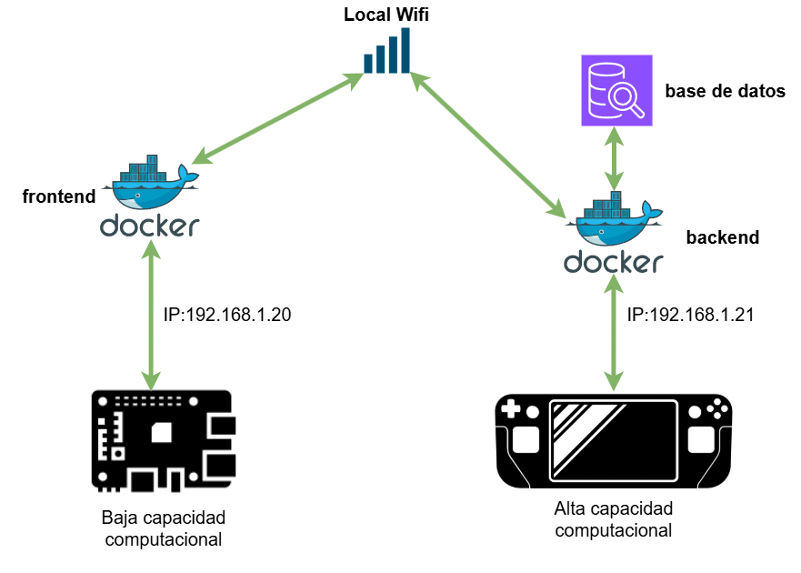
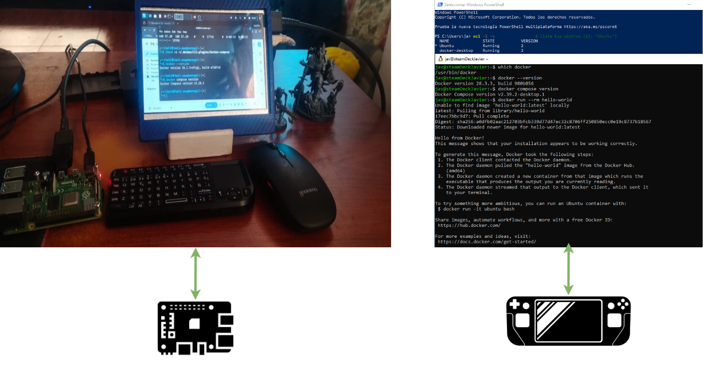

# Contenedores

El proyecto implementa una aplicación web tipo To-Do (CRUD) distribuida en tres servicios siguiendo el patrón de microservicios: frontend, backend (API) y base de datos.
- **Se despliega en dos máquinas de la red local (LAN):**
  - Máquina A – Steam Deck (Windows + Docker): aloja backend y base de datos en contenedores separados.
  - Máquina B – Raspberry Pi 4 (Docker ARM64): aloja el frontend estático servido por Nginx.

Objetivo didáctico: practicar orquestación con contenedores, separación de responsabilidades, comunicación entre servicios por red y uso de variables de entorno (12-factor).



- **Componentes y responsabilidades**
  - Frontend (Raspberry Pi 4, Docker) SPA construida (p. ej., React + Vite) y servida por Nginx.  
    Responsabilidad: interfaz de usuario y consumo de la API vía HTTP/JSON.  
  - Backend / API (Steam Deck, Docker) Servicio FastAPI (o Node/Express) que implementa la lógica de negocio y expone endpoints REST para crear, listar, actualizar y eliminar tareas.  
    Responsabilidad: validación, reglas de negocio, acceso a la BD.  
  - Base de datos (Steam Deck, Docker) Contenedor con PostgreSQL (o MySQL/MariaDB) que almacena las tareas en tablas relacionales.  
    Responsabilidad: persistencia y consultas de datos.  
- **Topología de red**
  - El frontend (Pi) se comunica con el backend (Deck) mediante la IP LAN de la Máquina A y el puerto 8000.
  - El backend se comunica con la base de datos por la red interna de Docker en la Máquina A (la BD no publica puertos al host).
  - No existe comunicación directa entre frontend y base de datos (principio de “backend-for-frontend”).



## 1.- Instalacion de docker
- **Raspberry Pi 4 Kali linux**
```bash
# Instala el engine desde Kali:
sudo apt update
sudo apt install -y docker.io
sudo systemctl enable --now docker
sudo usermod -aG docker $USER
newgrp docker

# Instala Compose v2 (ARM64):
mkdir -p ~/.docker/cli-plugins
curl -SL https://github.com/docker/compose/releases/download/v2.28.1/docker-compose-linux-armv7 \
  -o ~/.docker/cli-plugins/docker-compose
chmod +x ~/.docker/cli-plugins/docker-compose

# Probar:
docker --version
docker compose version

``` 
- **steam deck windows**
  - El frontend (Pi) se comunica con el backend (Deck) mediante la IP LAN de la Máquina A y el puerto 8000.
```bash
# en PowerShell:
wsl --install
wsl --set-default-version 2
wsl -l -v          # verifica que tu “Ubuntu” esté en versión 2

winget install -e --id Docker.DockerDesktop

wsl -l -v                 # lista tus distros
wsl --shutdown            # apaga todas

# dentro de Ubuntu (WSL)
which docker
docker --version
docker compose version
docker run --rm hello-world

``` 